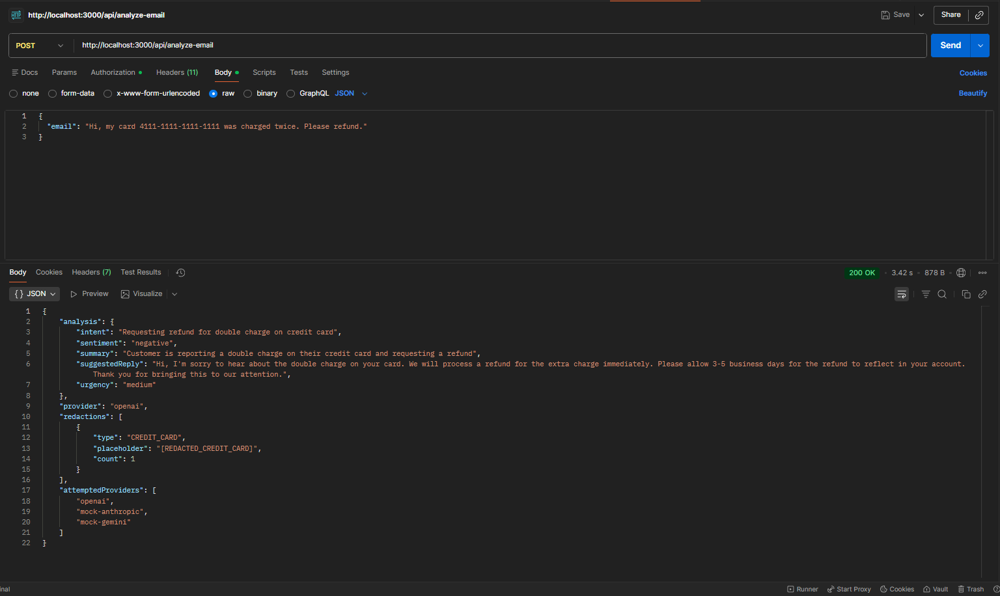
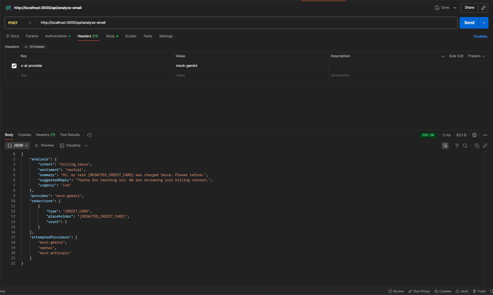
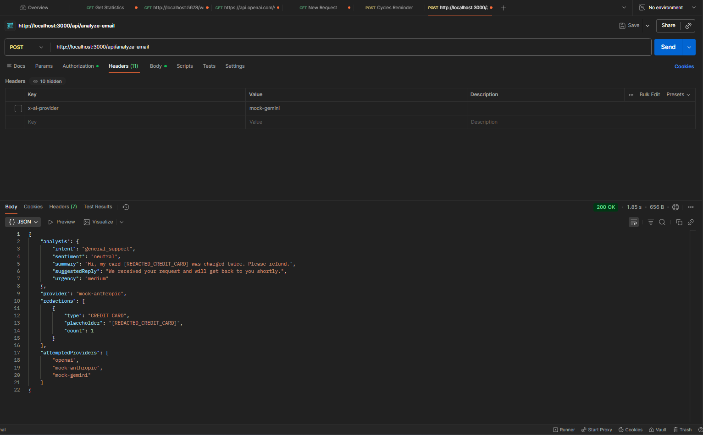

# SecureSupport Backend (Node/Express/TypeScript)

## Setup
1) Install deps  
```bash
npm install
```
2) Env vars (example)  
```bash
export PORT=3001
export AI_PROVIDER=openai          # default provider
export OPENAI_API_KEY=sk-...       # only needed for openai
```

## Run
```bash
npm run dev
```
API base: `http://localhost:3001/api`

## Endpoint
`POST /api/analyze-email`
- Body: `{ "email": "raw email text" }`
- Optional header: `x-ai-provider` to override provider per request  
  - `openai`, `mock-anthropic`, `mock-gemini`

## Sample cURL (provider override + shows fallback order)
```bash
curl -X POST http://localhost:3001/api/analyze-email \
  -H "Content-Type: application/json" \
  -H "x-ai-provider: mock-anthropic" \
  -d '{ "email": "Hi, my card 4111-1111-1111-1111 was charged twice." }'
```
Response includes:
- `analysis` (intent, sentiment, summary, suggestedReply, urgency)
- `provider` (which provider succeeded)
- `redactions` (what PII was scrubbed)
- `attemptedProviders` (order tried, useful for fallback visibility)

## Postman Examples

### Successful Response


### Provider Switching via Header


### Fallback Behavior



